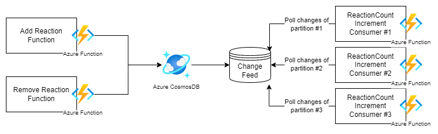

# Like Service
Purpose of this service is to handle users Reactions on Posts and their Comments.

## Functional Requirement

1. Add Reaction - Users should be able to put a reaction on Post and It's comment. Should allow multiple reaction types (ThumbsUp, Heart, Care, Laugh, Sad, Angry)
2. View Reaction count - User should be able to see the reaction counts of Post and it's Comments seperately.
3. Remove Reaction - Users should be able to remove Reaction they added
4. Only one reaction should allow for a Post or a Comment from one user.
5. User should be able to change the reaction type they provided.

## Non-Functional Requirement
1. Low Latency - There can be millions of reactions per post, Calculating count of reactions should be fast. 
2. High Availability - There can be millions of reactions per second hitting our service. Therefore our backend service should be highly available.
3. Consistency - Showing actual reaction count does not required to be real-time. Having a lag on showing it, is Okay. Stronger consistency not required.
4. Conflicts - There can be multiple concurrent reaction requests per post. We should avoid conflicts where 2 people trying to update the same entry resulting in invalid state if there any to consider (Ex: Calculating and storing some statistics data)

## Implementation Considerations

## FR #1 - <br>
How our model be like to store User Reactions on Post and it's Comments.
```
public record Reaction
{
  [JsonProperty("id")]
  public string Id { get; set; }
  public string PostId { get; set; }
  public string CommentId { get; set; }
  public string UserId { get; set; }
  public LikeType LikeType { get; set; }
  public DateTime Timestamp { get; set; }
 }
```
PartitionKey - /PostId


### FR #2 - <br>
To get the reaction count we could simply get all the items (documents) in the partition (postId) and count it. But it could be very slow and CPU intensive, cause there could millions of items (Reaction entries) per post in a partition. Which could break our **NFR #1 - Latency**. So we need a seperate materialized view named **reaction-count** to store those count of every reaction type of a post. This **reaction-count** container items will have one-to-one relationship with a post (one item per post).

This is how our denormalized reaction-count data model looks like.
```
public record ReactionCount
{
    [JsonProperty("id")]
    public string Id { get; set; }
    public string PostId { get; init; }
    public string CommentId { get; init; }
    public int LikeCount { get; set; } = 0;
    public int HeartCount { get; set; } = 0;
    public int WowCount { get; set; } = 0;
    public int CareCount { get; set; } = 0;
    public int LaughCount { get; set; } = 0;
    public int SadCount { get; set; } = 0;
    public int AngryCount { get; set; } = 0;
    public DateTime Timestamp { get; set; }
}
```

Problem with this approach is when concurrent users try to increment the same ReactionCount item of the same post. Let's say User#1 do Reaction request for the Post#1, User#2 do the same concurrently, when doing that User#1 and User#2 see the current reaction count as 10. So, both do increment the count 10 by 1 and Save it. Which result in invalid stats (count 11) storing in the DB. But the actual count after both requests should be 12. Which breaks our *NFR#4 - Conflicts*. To handle this scenario, there 3 approaches.
1. Distributed Locking - We could use some distributed lock mechanism avoid the conflicts (Ex: Redis Cache). Usually locking *could add latency* to our application API HTTP requests. But we could avoid by processing it using a background job (different process).
2. Optimistic Concurrency Control - Where we store version number on the Container Item and use that to avoid conflicts update, with a retry logic. But, this will result in increased round-trip to DB.
3. Increment count using the same process - In this approach we could use some sort of session enabled pub/sub or queue messaging solution, where Reaction count requests per post are **received as messages and make sure they processed by the same process**. Ex: Azure Service Bus session enabled topic or queue. In that case, we won't have any concurrent updates, cause stats update per post and done sequentially by one process. 

For our design, we will go for #approach #3# cause it is the cleanest one without locking and processing time overhead. In this case we need to let ServiceBus to identify which messages should be grouped and send to same Process (subscriber) using a *SessionId* provided in the message properties. For that we gonna pick *CommentId*, if not available *PostId*. We don't want the same concumer resposible for processing both Post reaction and all of it's Comment reactions as well. That could delay the stats counter. Cause we want sequential processing for container item level. Not the whole partition key.

### FR #4 - <br>
To achieve this we need to maintain a unique constraint on `/UserId` and `/CommentId`. NoSQL databases follow BASE model, where S stands for **Soft State**. Which describes due to the lack of immediate consistency, data values may change over time. So there is a very good possibility that data conflicts and data integrity issues could occur. Which must handled by the developers. So, in this case there could be data integrity issue, when user doing multiple API calls which gonna insert duplciate reactions. But in CosmosDB, there is a extra layer of data integrity called **Unique Key Constraint**, which can guarantee uniqueness **within a partition key**. So we could add this Unique Key Constraint policy to achive this requirement. 


## Solution #1 - CosmosDB Change Feed Processor (Polling)


In this solutin, we can use the Azure Cosmos DB **Change Feed** core feature which available with NoSQL API and enable by default for all the accounts. This change feed feature is an Event Sourcing store, which simply track changes (Insert/Update) to a logical partition as an Event objects, and store them seperately in sequence (in-ordered) where they were applied. Which then we can use and replay them to restore the state to where they were in during a particular time.  

We can utilize this feature using an Azure Functions CosmosDB trigger, which implements using the Change Feed Processor, which periodically poll for changes of a container (by default it's 5 secs). Also, this feature is capable of distributing traffic accross multiple consumers (Multiple threads or machines), based on the **physical partitions**. This way we could use these information to create total reaction count materialized view.

### Problems with this approach
1. Item Delete actions are not captured in ChangeFeed - Need seperate soft delete approach, where we gonna toggle Active state column to false during Delete action. And then use a CosmosDB Trigger to actually remove it based on that soft state. That way we would have an entry to capture Deletion in ChangeFeed. 
2. Compute is distributed based on Physical Partition - This way we gonna have huge load on one Function to iterate through all changes happen during a one physical partition. If we have huge amount of reactions (1M) per post for a short period (Let's say 5sec), then all those reactions would need to be process by one Function. Which may result in Function timeout in consumption plan. Which is not ideal. We need more flexible scaling to handle such huge load. Maybe scale based on logical partition instead of physical partition.
3. Handling Reaction Type change - If a user change his reaction to a different one, this change feed may not contain the previous reaction type to decrement previous reaction total count. Ex: Post have 10 Likes & 15 Hearts. A user change his reaction from Like to Heart should result in 9 Likes, 16 Hearts. This require additional implementation to handle such scenario.


## Solution #2 - Events Publish to Service Bus Topic (Pushing)

In this solution, what we can do is instead rely on CosmosDB Event Sourcing store (the Change Feed) we manually maintain and publish our changes as Events to some store, where we can utilized this later by our Reaction Counting function. To store that, we can **Azure Service Bus Topics**, which implements Pub/Sub messaging model. In this case, using Pub/Sub model we could scale our applications to react to these events not just by one consumer but by multiple consumers. For example, today it's just the ReactionCounter function listen to these events, But tomorrow it gonna be another Service named Notification Service which gonna listen to those events and sending push notifications to the author of the post about reactions. And this model will push the data
